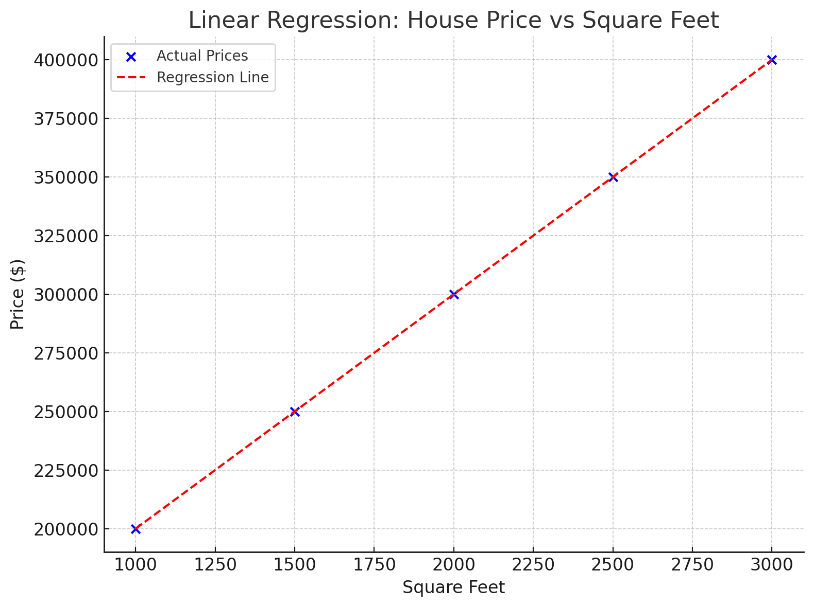

## 🔢 What is Linear Regression?

**Linear Regression** is a **statistical method** used to model the relationship between a **dependent variable** (e.g., house price) and one or more **independent variables** (e.g., square footage).

In **simple linear regression**, there’s **one independent variable**.

---

## 🏡 Example: House Price vs Square Feet

Imagine you collected data for houses:

| Square Feet (sqft) | Price ($)  |
|--------------------|------------|
| 1000               | 200,000    |
| 1500               | 250,000    |
| 2000               | 300,000    |
| 2500               | 350,000    |
| 3000               | 400,000    |

From the table, you might notice:  
> As **square footage increases**, the **price increases** — this is a linear relationship.

---

## 📈 Linear Regression Formula

The formula for simple linear regression is:

\[
\text{Price} = m \cdot (\text{sqft}) + b
\]

Where:
- `m` = **slope** of the line (how much price increases per square foot)
- `b` = **intercept** (price when square feet = 0)
- `sqft` = square footage (input)
- `Price` = predicted price (output)

### Example:
If we find that:
- `m = 100` (price increases by $100 for every additional square foot)
- `b = 100,000` (base price)

Then:
\[
\text{Price} = 100 \cdot \text{sqft} + 100,000
\]

So for a house with 2,000 sqft:
\[
\text{Price} = 100 \cdot 2000 + 100000 = 200,000 + 100,000 = 300,000
\]

---

## 🗄️ Illustration

Here’s what it looks like on a graph:



- **X-axis**: Square Feet  
- **Y-axis**: Price  
- **Data Points**: (1000, 200000), (1500, 250000), etc.
- **Line of Best Fit**: A straight line going through or near the points showing the general trend.

In the graph above:
- **Blue dots** represent actual house data points.
- The **red dashed line** is the **linear regression line** (line of best fit), based on the formula:
  \[
  \text{Price} = 100 \cdot \text{sqft} + 100,000
  \]

This line helps us **predict the price** of a house based on its **square footage**.

---

## 🧠 Goal of Linear Regression

We want to find the **best-fitting line** through a set of points. That means:

\[
\text{Price} = m \cdot \text{sqft} + b
\]

...should be as close as possible to the actual prices for all the houses.

To do this, we calculate:

### 📌 1. **Slope (m)** — how steep the line is  
### 📌 2. **Intercept (b)** — where the line crosses the Y-axis (price when sqft = 0)

---

## 📐 How to Calculate `m` and `b`

Let’s say you have `n` data points:  
\((x_1, y_1), (x_2, y_2), ..., (x_n, y_n)\)

Where:
- \(x\) = square feet  
- \(y\) = price  

### 🔹 Step 1: Calculate the Averages

\[\bar{x} = \text{average of all } x_i \quad (\text{mean sqft})\]  
\[\bar{y} = \text{average of all } y_i \quad (\text{mean price})\]

### 🔹 Step 2: Calculate the Slope `m`

\[m = \frac{\sum (x_i - \bar{x})(y_i - \bar{y})}{\sum (x_i - \bar{x})^2}\]

This is called the **least squares method** — it minimizes the total squared error between predicted and actual prices.

### 🔹 Step 3: Calculate the Intercept `b`

\[b = \bar{y} - m \cdot \bar{x}\]

Now you have both values:
- `m` tells you how much price goes up per sqft.
- `b` tells you the starting price when sqft is 0.

---

## 💡 Let’s Do a Quick Example

Using this dataset:

| Square Feet (x) | Price (y) |
|------------------|-----------|
| 1000             | 200000    |
| 1500             | 250000    |
| 2000             | 300000    |
| 2500             | 350000    |
| 3000             | 400000    |

We’ll plug this into the formulas and calculate `m` and `b` together.

📅 The calculation gives us:
- **Slope (m)** = `100.0`
- **Intercept (b)** = `100,000.0`

So the final regression formula is:
\[
\text{Price} = 100 \cdot \text{sqft} + 100,000
\]

This means:
- For every **additional square foot**, the price increases by **$100**.
- Even if a house had **0 sqft** (hypothetically), it would start at **$100,000**.

---

## ✅ How It Works

Once you have the formula:

\[\text{Price} = m \cdot \text{sqft} + b\]

You can plug in **any square footage value** — even if it wasn’t in your training data — and the model will **predict the price**.

### 🔮 Example
Let’s say your formula is:

\[\text{Price} = 100 \cdot \text{sqft} + 100,000\]

#### Want to predict for 1800 sqft?

\[\text{Price} = 100 \cdot 1800 + 100000 = 180,000 + 100,000 = 280,000\]

#### What about 3500 sqft?

\[\text{Price} = 100 \cdot 3500 + 100000 = 350,000 + 100,000 = 450,000\]

---

## 📌 This is Why We Train the Model

We fit the line to **known data** so it can generalize and make predictions on **new, unseen inputs**.

Just remember:
- It works best when the new inputs are **within or near the range of the training data**.
- Predicting **far outside** that range (e.g., 10,000 sqft) can be risky — the linear assumption may not hold.

---

## 📅 Mean Values

Here are the results:

- **Mean square feet** \( \bar{x} \) = **2000.0**
- **Mean price** \( \bar{y} \) = **300,000.0**

These are the average values of your dataset, and they're used to calculate the slope (`m`) and intercept (`b`) of the regression line.

---

## ✅ Full Example with Scikit-Learn

```python
from sklearn.linear_model import LinearRegression
import numpy as np

# Step 1: Create your data
# X must be 2D (e.g., [[1000], [1500], ...])
X = np.array([1000, 1500, 2000, 2500, 3000]).reshape(-1, 1)
y = np.array([200000, 250000, 300000, 350000, 400000])

# Step 2: Create and train the model
model = LinearRegression()
model.fit(X, y)

# Step 3: Get slope and intercept
m = model.coef_[0]
b = model.intercept_

print("Slope (m):", m)
print("Intercept (b):", b)
```

### 🧮 Output:
```
Slope (m): 100.0
Intercept (b): 100000.0
```

So the learned regression line is:
\[\text{Price} = 100 \cdot \text{sqft} + 100000\]

---

### 🔮 To Predict New Values

```python
# Predict price for a 2200 sqft house
predicted_price = model.predict([[2200]])
print("Predicted price for 2200 sqft:", predicted_price[0])
```

