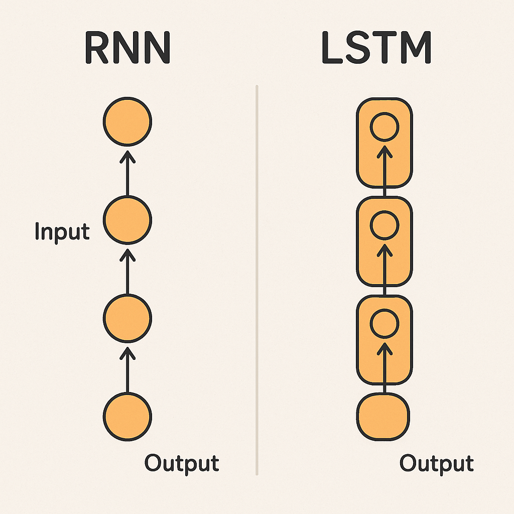

### 🧠 What is Backpropagation?

Backpropagation is **how a neural network learns from its mistakes**.

Think of it like this:

1. **Guess** – The network makes a prediction (like guessing if a photo is of a cat or a dog).
2. **Check** – We see how wrong the guess was (this is called the **error**).
3. **Blame** – We figure out which parts of the network caused the mistake.
4. **Fix** – We send a “correction signal” backwards through the network to adjust the connections (weights) so it can do better next time.

---

### 🎯 A Simple Analogy:

Imagine shooting basketballs at a hoop while blindfolded:

1. You throw the ball (make a prediction).
2. Your friend tells you, “You missed — it was too far to the left” (error).
3. You think, “Ah, my arm was angled wrong” (figuring out which part caused the mistake).
4. You adjust your throw next time (updating weights).

---

### ⚙️ Why it’s called “back” propagation:

The “correction” travels **from the end of the network (output)** back to the start (input), telling each layer how to adjust. This backwards travel is what the “back” in backpropagation means.

Alright — here’s how **backpropagation** and the **vanishing gradient problem** fit together, in our middle school–friendly way.

---

### 📦 Step 1: Backpropagation is the delivery truck of corrections

When a neural network makes a mistake, backpropagation sends **correction signals** backward from the output layer to the input layer.
Think of it like **a delivery truck carrying instructions** to each layer:

> “Hey Layer 1, adjust your weight a little! Layer 2, you did okay but tweak this part!”

---

### 🪫 Step 2: The fading battery problem (Vanishing Gradient)

Now imagine the truck’s battery gets weaker and weaker the further it drives back.
By the time it reaches the **first layers**, the signal is so weak it’s almost gone.
Those early layers barely get any instructions, so they **don’t improve much** — or at all.

---

### 🔗 How they connect:

* **Backpropagation** = the *method* for sending error signals backward so the network can learn.
* **Vanishing gradient** = a *problem* that happens **during** backpropagation, when the signals shrink so much they “vanish” before reaching the early layers.

---

**In short:**

> Backpropagation is how learning happens.
> Vanishing gradient is when learning *stalls* because the “learning signal” fades away before it reaches the start of the network.

---

### 🌀 First, a quick RNN recap

An **RNN** (Recurrent Neural Network) is like a note-passing system in class:

* Each time step passes a “note” to the next time step.
* That note carries memory of what happened before.
  This is great for things like predicting the next word in a sentence — because it remembers what came earlier.

---

### 🚧 Where vanishing gradient hits hard

When training an RNN, backpropagation doesn’t just go through layers… it also goes **back in time**.
This is called **Backpropagation Through Time (BPTT)**.

If the gradients (correction signals) shrink too much as they go backward in time:

* The RNN **forgets long-term information**.
* It can only learn from a few steps back, not from the distant past.

---

### 📖 Story analogy

Imagine reading a book and at the end your friend asks,

> “Why did the main character make that decision?”
> If you have a **vanishing gradient problem**, it’s like you can only remember the last *page or two* — not the important event that happened 50 pages ago.
> So your answer is incomplete, because your “memory” faded too quickly.

---

### 💡 Real-life effect

* RNNs with vanishing gradients struggle with **long sentences** in language translation.
* They might remember the last few words, but forget important words from earlier in the sentence.

---

---

## 🦸 LSTM and GRU — The Memory Keepers

When scientists saw RNNs **forgetting the past** because of the **vanishing gradient problem**, they invented special types of RNN cells:

* **LSTM** = Long Short-Term Memory
* **GRU** = Gated Recurrent Unit

Both are designed to **remember important information for a long time** and **ignore unimportant details**.

---

### 🛠 How they fix vanishing gradient

In normal RNNs, the correction signal during backpropagation fades as it goes backward in time.
LSTMs and GRUs **add “gates”** — little switches that decide:

* What to keep
* What to throw away
* When to pass information forward

Because of these gates, **important signals don’t fade away** — they get carried along almost unchanged.
This means the gradients **stay strong** even when going far back in time.

---

### 📖 Story analogy

Remember the note-passing classroom?

* In a regular RNN, notes get smudged and unreadable after a few passes.
* In an LSTM or GRU, each student has a **special folder** with important notes. They decide which notes to keep safe and which ones to toss. Even after 50 passes, the important notes are still clear and readable.

---

### 🔍 Difference between LSTM and GRU (simple version)

* **LSTM** → Has more gates and a separate “cell state” (more powerful but slightly heavier).
* **GRU** → Fewer gates, simpler, often faster, but still fixes vanishing gradient.

---

### 🚀 Why this matters

With LSTMs and GRUs:

* Translation models can remember the **start of a sentence** even after processing many words.
* Speech recognition can remember **context** from earlier in the conversation.
* Predictive text can recall important earlier details, not just the last few words.

Yes — there are a few more useful points to round out your understanding of **vanishing gradients**, especially if we want a complete picture:

---

## 1️⃣ It’s not just RNNs — deep feedforward networks can suffer too

* Any **very deep network** (many layers) can have this issue, not just RNNs.
* In CNNs or fully connected nets, very small gradients can stop early layers from learning.

---

## 2️⃣ The opposite problem: exploding gradients

* Sometimes the gradients don’t shrink — they **blow up** and become huge.
* This makes training unstable.
* We often fix exploding gradients with **gradient clipping** (limiting their size).

---

## 3️⃣ Common fixes for vanishing gradients

* **Better activation functions** – ReLU (and its variants like Leaky ReLU, ELU) don’t squash values like sigmoid/tanh do, so they help keep gradients alive.
* **Batch normalization** – Helps keep values in a good range for training.
* **Residual connections** – Used in ResNets to let information skip layers and avoid signal loss.
* **LSTMs/GRUs** – Specifically for RNNs, as we covered.

---

## 4️⃣ Why it happens mathematically (very simplified)

* Gradients are multiplied as they move backward.
* If the numbers being multiplied are **less than 1**, they get smaller and smaller → fade away.
* If they’re **greater than 1**, they blow up (exploding gradient).

---

## 5️⃣ Why it’s important to understand

* It explains why certain architectures (ResNet, LSTM) were invented.
* It helps you choose the right activation functions and initialization methods.
* It’s a big reason why *modern deep learning works better than older deep nets* — we now have tricks to avoid it.

---

If you want, I can make a **single visual “cheat sheet”** that ties together

* backpropagation
* vanishing gradients
* exploding gradients
* and common fixes
  so it’s all in one place. That would make a nice study reference.
