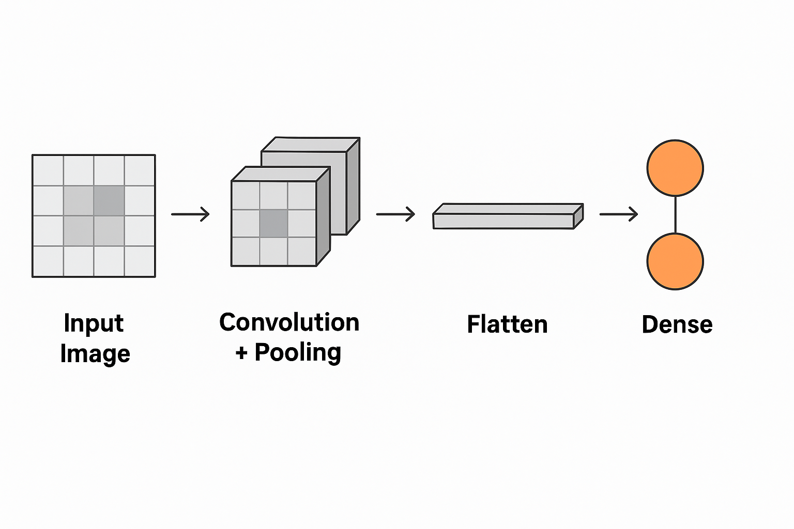

## 🎯 Objective:

We want to train a computer to recognize **handwritten digits** (0–9) using images. This is a **classification problem**, and CNNs are excellent for analyzing images.

We'll use the **MNIST dataset**, which contains 70,000 grayscale images (60,000 for training and 10,000 for testing), each 28x28 pixels.

---

## 🧪 Step 1: Import the Tools

We’ll be using **TensorFlow and Keras**, which make building neural networks much easier.

```python
import tensorflow as tf
from tensorflow.keras.models import Sequential
from tensorflow.keras.layers import Conv2D, MaxPooling2D, Flatten, Dense
```

These are the building blocks of our CNN:

* `Conv2D`: The convolution layer that detects patterns.
* `MaxPooling2D`: Downsamples the image to focus on important features.
* `Flatten`: Converts the image into a 1D array.
* `Dense`: A fully connected layer that makes decisions.

---

## 🧱 Step 2: Build the CNN Model

```python
model = Sequential([
    Conv2D(32, kernel_size=(3, 3), activation='relu', input_shape=(28, 28, 1)),
    MaxPooling2D(pool_size=(2, 2)),

    Conv2D(64, kernel_size=(3, 3), activation='relu'),
    MaxPooling2D(pool_size=(2, 2)),

    Flatten(),
    Dense(64, activation='relu'),
    Dense(10, activation='softmax')
])
```

Let’s explain each layer in detail:

### 🔹 Conv2D Layer

```python
Conv2D(32, kernel_size=(3, 3), activation='relu', input_shape=(28, 28, 1))
```

* **Purpose**: Detect small patterns (like lines or curves) in the image.
* **32 filters**: It creates 32 pattern detectors.
* **Kernel size (3x3)**: Each filter looks at a 3x3 section of the image.
* **Activation = relu**: Introduces non-linearity so the model can learn complex things.
* **Input shape = (28, 28, 1)**: 28x28 pixels, 1 channel (grayscale).

### 🔹 MaxPooling2D

```python
MaxPooling2D(pool_size=(2, 2))
```

* **Purpose**: Reduces the image size by taking the maximum value in a 2x2 grid.
* This **shrinks** the image and **keeps important features**, reducing computation.

### 🔹 Repeat Conv + Pool

```python
Conv2D(64, kernel_size=(3, 3), activation='relu')
MaxPooling2D(pool_size=(2, 2))
```

* The second pair of convolution and pooling layers detect **more complex patterns**, built on the earlier ones (e.g., shapes, corners).

### 🔹 Flatten Layer

```python
Flatten()
```

* Converts the 2D grid of numbers into a 1D array (like `[0.2, 0.7, 0.4, ...]`).
* This prepares the data for the final classification layers.

### 🔹 Dense Layers

```python
Dense(64, activation='relu')
Dense(10, activation='softmax')
```

* `Dense(64)`: Fully connected layer with 64 neurons. Learns patterns from features extracted by CNN.
* `Dense(10)`: Output layer — **10 neurons**, one for each digit (0 to 9).
* `softmax`: Converts outputs into probabilities that add up to 1.

---

## ⚙️ Step 3: Compile the Model

```python
model.compile(
    optimizer='adam',
    loss='sparse_categorical_crossentropy',
    metrics=['accuracy']
)
```

### 🔍 What does this mean?

* **optimizer = 'adam'**: A smart way to update weights using gradient descent.
* **loss = 'sparse\_categorical\_crossentropy'**:

  * Because we’re doing **multi-class classification** (10 classes),
  * and our labels are **integers** (not one-hot encoded).
* **metrics = \['accuracy']**: We want to see how many predictions are correct.

---

## 📦 Step 4: Load and Prepare the Data

```python
from tensorflow.keras.datasets import mnist

(x_train, y_train), (x_test, y_test) = mnist.load_data()
```

* Loads the training and test data.
* Each `x_train` is a **28x28 image**.
* Each `y_train` is a **label** from 0 to 9.

---

### 🧼 Step 5: Preprocess the Data

```python
x_train = x_train.reshape(-1, 28, 28, 1) / 255.0
x_test = x_test.reshape(-1, 28, 28, 1) / 255.0
```

#### 🔎 Why this is important:

* **reshape**: Adds the “channel” dimension to images. CNNs expect 4D input: (samples, height, width, channels).
* **divide by 255**: Normalizes pixel values from 0–255 → 0–1, which helps the model learn better.

---

## 🏃‍♂️ Step 6: Train the Model

```python
model.fit(x_train, y_train, epochs=5, validation_data=(x_test, y_test))
```

* **epochs=5**: Run through all training images 5 times.
* **validation\_data**: While training, it checks accuracy on test data to make sure it's learning properly.

---

## 🔮 Step 7: Make Predictions

```python
predictions = model.predict(x_test)
print("Predicted label:", tf.argmax(predictions[0]).numpy())
```

* `predict()` gives you 10 probability scores for each digit.
* `tf.argmax(...)` gets the **digit with the highest score**.

---

## 🧠 Summary

| Step           | What It Does                              |
| -------------- | ----------------------------------------- |
| 1. Import      | Load libraries                            |
| 2. Build Model | Create CNN layers                         |
| 3. Compile     | Set optimizer and loss                    |
| 4. Load Data   | Get MNIST digit data                      |
| 5. Preprocess  | Reshape and normalize                     |
| 6. Train       | Teach the CNN on data                     |
| 7. Predict     | Use the trained model to guess new images |


