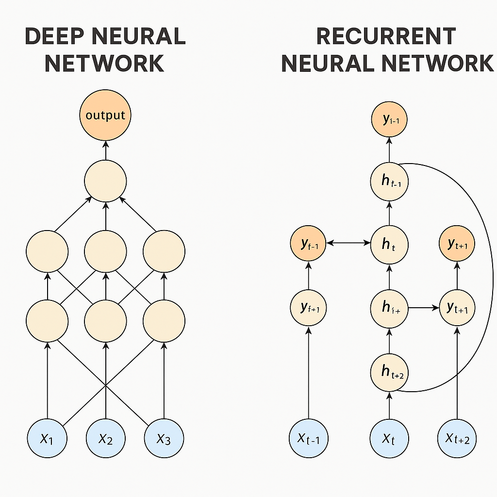

Let’s break it down step-by-step.

---

## 1. **What is an RNN?**

A **Recurrent Neural Network (RNN)** is a type of neural network designed for **sequential data** — where the order of the inputs matters.

* **Key Idea:**
  Instead of processing all inputs independently (like a standard feedforward network), an RNN **remembers** information from previous steps using a **hidden state** that’s updated at each time step.
* **Typical Use Cases:**

  * Predicting the next word in a sentence (language modeling)
  * Speech recognition
  * Time series forecasting
  * Video sequence analysis

---

### How It Works:

At each time step `t`, an RNN:

1. Takes the **current input** `xₜ`
2. Combines it with the **previous hidden state** `hₜ₋₁`
3. Produces:

   * **Output** `yₜ` (e.g., a prediction)
   * **Updated hidden state** `hₜ` for the next step

**Formula (simplified):**

```
hₜ = f(Wₓ * xₜ + Wₕ * hₜ₋₁ + b)
yₜ = g(Wᵧ * hₜ + bᵧ)
```

Where `f` and `g` are activation functions.

---

## 2. **How is it different from a Deep Neural Network (DNN)?**

| Feature          | Deep Neural Network (DNN)                                       | Recurrent Neural Network (RNN)                                               |
| ---------------- | --------------------------------------------------------------- | ---------------------------------------------------------------------------- |
| **Data type**    | Works best with independent, fixed-size inputs                  | Designed for sequential or time-dependent inputs                             |
| **Memory**       | No memory of past inputs — each input is processed in isolation | Has a hidden state that carries information from previous steps              |
| **Architecture** | Layers are connected only forward                               | Has loops/recurrent connections that feed output from one step into the next |
| **Training**     | Standard backpropagation                                        | Uses **Backpropagation Through Time (BPTT)**                                 |
| **Examples**     | Image classification, tabular data prediction                   | Text generation, time series forecasting                                     |

---

## 3. **Simple Real-World Analogy**

* **DNN:** Like a photo camera — it takes a single shot and processes it without knowing what came before.
* **RNN:** Like a video camera — it processes each frame but also remembers the previous frames to make sense of the story.

---

## 4. **Where the Difference Matters**

If you give both models the phrase:

> “The cat sat on the \_\_\_”

* **DNN:** Looks only at the current words and might guess randomly (it doesn’t remember what came before).
* **RNN:** Remembers that earlier you mentioned “cat sat” and is more likely to guess “mat” because it uses the sequence context.

---




RNNs are used in areas where **data is sequential** and **context from previous inputs matters**. Here are the main applications:

---

## **1. Natural Language Processing (NLP)**

RNNs can process words in order, making them suitable for text-based tasks.

* **Examples:**

  * **Language modeling** – predicting the next word in a sentence
  * **Text generation** – writing paragraphs, poetry, or code based on prior text
  * **Machine translation** – converting sentences from one language to another
  * **Sentiment analysis** – determining if text expresses positive or negative emotion

---

## **2. Speech Processing**

RNNs can model the time dependencies in sound waves.

* **Examples:**

  * **Speech-to-text** (e.g., voice assistants like Siri, Alexa)
  * **Speaker identification**
  * **Emotion detection in voice**

---

## **3. Time Series Forecasting**

Since RNNs remember past data, they’re useful for predicting future values in a sequence.

* **Examples:**

  * Stock price forecasting
  * Weather prediction
  * Demand forecasting in retail

---

## **4. Video & Sequential Image Analysis**

RNNs can understand frame-by-frame dependencies in videos.

* **Examples:**

  * Video captioning
  * Human action recognition
  * Surveillance anomaly detection

---

## **5. Music & Audio Generation**

RNNs can generate music or sound by learning patterns over time.

* **Examples:**

  * Composing melodies
  * Generating sound effects

---

✅ **Modern note:**
While RNNs (including LSTM and GRU variants) are still used, many applications have shifted to **Transformers** because they handle long-term dependencies better. However, RNNs are still valuable for smaller datasets and real-time tasks due to their lower computational cost.

Alright — let’s strip away the code and get into **how RNNs work for language translation** in a way a high schooler can follow.

---

## 📖 The Big Idea

When you use **Google Translate** or a similar tool, the computer doesn’t just look at each word by itself — it needs to **understand the whole sentence** so it can rewrite it in another language while keeping the meaning.

An **RNN (Recurrent Neural Network)** helps with this because it can **remember what came before** in a sentence.

---

## 🛠 How It Works Step-by-Step

### 1. **Reading the sentence (Encoder)**

* Imagine the RNN as a person listening to a sentence **one word at a time**.
* At each word, it updates its **memory** (called a *hidden state*) to store important information.
* Example: For the sentence **"I am going to school"**, it first reads “I”, then remembers “I am”, then “I am going”… and so on.

---

### 2. **Creating a summary**

* After reading the whole sentence, the RNN ends up with a **summary of the meaning** stored in its hidden state.
* This summary isn’t in English or any other language — it’s just numbers the computer understands that capture the sentence’s essence.

---

### 3. **Writing in another language (Decoder)**

* Now a second RNN takes over.
* It starts with the summary and begins generating the translation **one word at a time** in the target language.
* Example: It might start with “Je” (in French for “I”), then “vais” (“am going”), then “à l’école” (“to school”).

---

## 🎯 Why RNNs are Good for This

* **Order matters** — “dog bites man” ≠ “man bites dog”.
* They **carry memory forward**, so earlier words influence later choices.
* They can work with **different sentence lengths** — they don’t need the same number of words in input and output.

---

## 🔍 Real Example

English: *“I love ice cream”*
RNN reads and remembers → Summary → RNN writes: *“J’adore la glace”*

It knows “ice cream” means “glace” (not “ice” + “cream” separately) because it remembers the **context**.

---

## 🚦 The Catch

* Early RNNs struggled with **long sentences** (they forgot earlier words).
* That’s why modern translators often use **LSTMs, GRUs**, or **Transformers**, which are upgraded versions that remember better.

---

