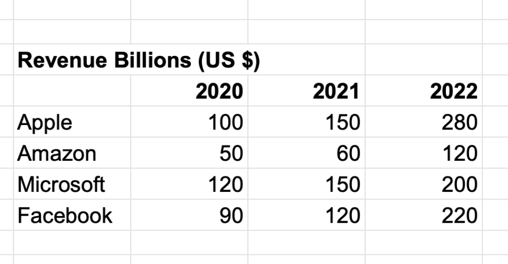
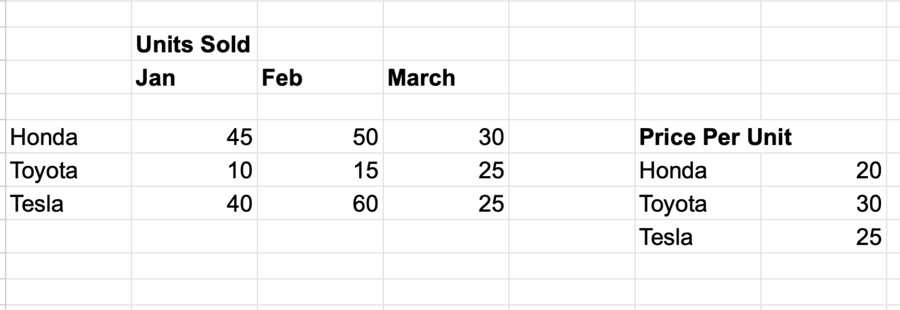

## Matrix Math Activity 

1. Below is some companies revenues in US dollars. Using numpy can you convert this into Mexican Pesos? 1 USD = 21 Pesos

2. AutoHub is a car shop that sells different types of cars. Below is the table showing how many cars of each type they sold in different months. Also given are the prices of one car of each type. Using this information, calculate their total sales for each month.

