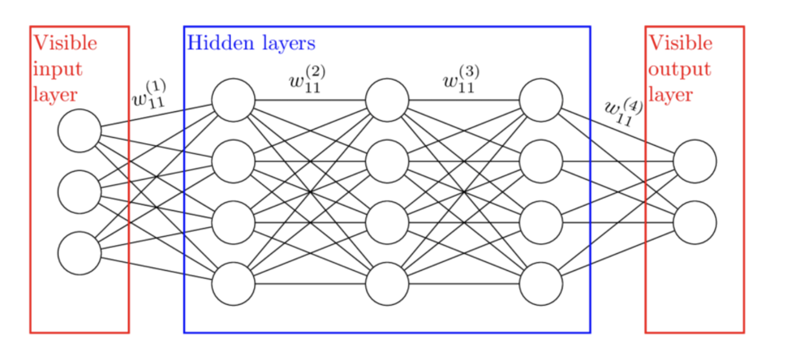

# Purpose of Layers in Deep Learning 

Autonomous vehicles use deep learning to process and understand visual information from their surroundings. Here's how hidden layers play a crucial role:

1. **Input Layer**:
   - **Function**: Takes high-resolution images from the car's cameras, represented as pixel arrays.

2. **Hidden Layers**:
   - **First Hidden Layer**: Detects basic features such as edges and textures.
   - **Second Hidden Layer**: Recognizes more complex patterns like corners and curves.
   - **Third Hidden Layer**: Identifies parts of objects like wheels and headlights.
   - **Deeper Layers**: Recognizes entire objects such as pedestrians, vehicles, and road signs, building a comprehensive scene understanding.

3. **Output Layer**:
   - **Function**: Provides probabilities for the presence and location of various objects, like pedestrians or stop signs.

### Importance of Hidden Layers

- **Non-linear Transformations**: Enable the network to learn complex relationships between pixel values and high-level concepts like pedestrian recognition.
- **Hierarchical Feature Extraction**: Layers progressively build from simple features to complex objects, essential for accurate visual interpretation.
- **Capacity and Flexibility**: Allows the network to generalize from training data to real-world scenarios, handling the complexity of driving environments.
- **Practical Performance**: Supports split-second decision-making by interpreting visual inputs accurately and reliably.

### Practical Impact

Thanks to hidden layers, autonomous vehicles can:
- **Detect Obstacles**: Identify pedestrians, cyclists, and other obstacles to avoid collisions.
- **Recognize Traffic Signs**: Interpret and obey traffic signals.
- **Lane Detection**: Identify lane markings to stay within lanes and perform safe lane changes.
- **Environmental Understanding**: Navigate complex driving environments like intersections and construction zones.

Without hidden layers, these complex tasks wouldn't be possible. Hidden layers enable the hierarchical feature processing that makes deep learning effective for autonomous driving.

